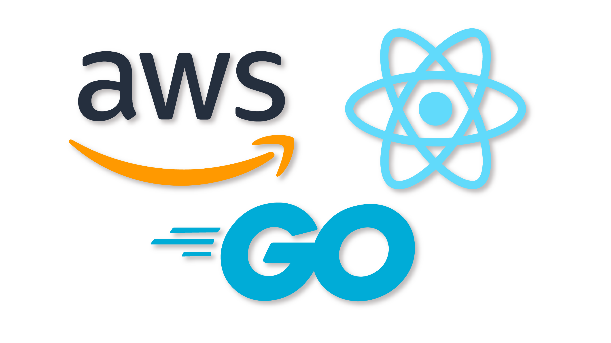

# Bedrock Trio: AWS, React & Go

This repository relies on the following repo [AWS Bedrock with Go][repo]. We will be setting up the frontend.

### Prerequisites

Before starting up this project, make sure you have the necessary dependencies installed in your machine.

### Software Installation

- [x] [Node](https://nodejs.org/en) - Node.js is a JavaScript runtime built on Chrome's V8 JavaScript engine.

- [x] [WebStorm](https://www.jetbrains.com/webstorm/) - The JavaScript and TypeScript IDE.

### Tutorial

You can follow the tutorial step by step by clicking on this link => [AI Assistant with AWS Bedrock and Go](https://www.jetbrains.com/guide/go/tutorials/bedrock_with_go/).

[repo]: https://github.com/mukulmantosh/goapp_genai